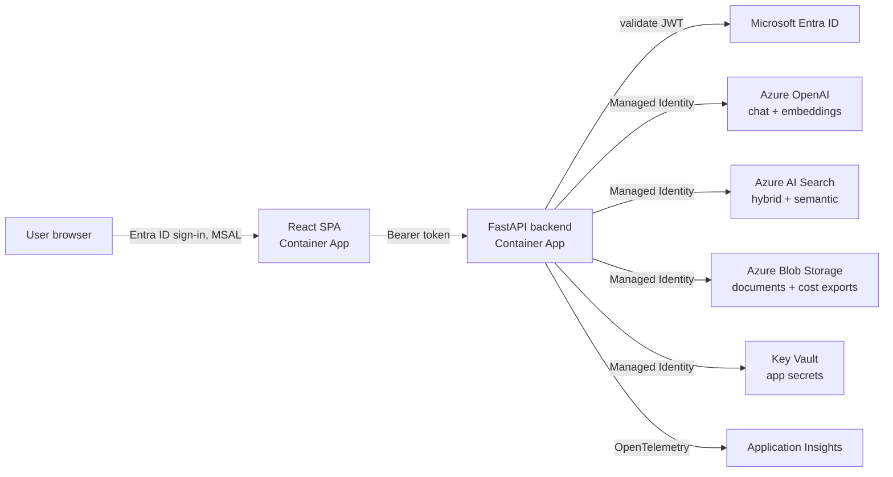

# Azure Enterprise Agentic AI Platform

[](https://github.com/ara-5/Azure-Enterprise-Agentic-AI/actions/workflows/ci.yml)
[](LICENSE)


An enterprise-grade **Agentic RAG platform** on Azure: Azure OpenAI + Azure AI Search for retrieval-augmented
generation, a Semantic Kernel agent that decides which tools to call, Entra ID auth end-to-end, Managed
Identity everywhere (no secrets in config), full observability via Application Insights, per-request cost
tracking against a budget, an automated RAG-quality evaluation gate, and infra-as-code + CI/CD to deploy it
all to Azure Container Apps.

> Built and deployed an enterprise Agentic RAG platform using Azure OpenAI and Azure AI Search — with
> Entra ID auth, Managed Identity, Application Insights observability, automated evaluation, and per-request
> cost tracking, deployed via Bicep + GitHub Actions to Azure Container Apps.

## Try it in under a minute — no Azure account needed

```bash
git clone https://github.com/ara-5/Azure-Enterprise-Agentic-AI.git && cd Azure-Enterprise-Agentic-AI
cp .env.example .env
docker compose up --build
```

Open http://localhost:5173 and ask it something. `DEMO_MODE=true` is the default in `.env.example`: local
keyword retrieval over the bundled sample HR/security/finance docs stands in for Azure OpenAI + AI Search
(see [`backend/app/rag/demo.py`](backend/app/rag/demo.py)), so the whole request flow — retrieve, cite
sources, route to the right agent tool, track cost — runs with zero cloud dependency and zero spend. A banner
in the UI makes it clear when you're in demo mode. Flip `DEMO_MODE=false` and fill in real Azure credentials
to run the actual pipeline (see [Deploying to Azure](#deploying-to-azure)).

<!--
  Add a screenshot or short GIF of the chat UI here once you've run it locally, e.g.:
  
-->

## What this project demonstrates

Built to be read by both an ATS and a hiring manager — every item below is a real, working part of this repo,
not a claim:

- **Retrieval-augmented generation** on Azure OpenAI + Azure AI Search (hybrid BM25 + vector + semantic
  ranking), with source citations on every answer ([`app/rag/pipeline.py`](backend/app/rag/pipeline.py))
- **Agentic AI**: a Semantic Kernel agent that decides per-turn which tool to call — knowledge-base search vs.
  a cost-lookup tool — rather than a fixed retrieve-then-answer pipeline ([`app/agents/orchestrator.py`](backend/app/agents/orchestrator.py))
- **Zero-trust identity**: Microsoft Entra ID for user auth (JWT validation, app-role authorization) and a
  single user-assigned Managed Identity for every service-to-service call — no API keys or connection strings
  in config anywhere in the deployed system ([`docs/architecture.md#security-posture`](docs/architecture.md#security-posture))
- **Infrastructure as Code**: every Azure resource (8 services) provisioned via Bicep with least-privilege
  RBAC role assignments, validated in CI (`az bicep build`) on every PR ([`infra/`](infra/))
- **CI/CD**: GitHub Actions with OIDC federated credentials (no stored cloud secrets), separate lint/test,
  build/deploy, and scheduled quality-gate pipelines ([`.github/workflows/`](.github/workflows/))
- **LLM evaluation as a CI gate**: golden-dataset scoring on groundedness, relevance, coherence (Azure AI
  Evaluation SDK) and retrieval precision, failing the build on regression ([`backend/evaluation/`](backend/evaluation/))
- **FinOps / cost governance**: every token is metered into USD in real time, tracked against a monthly
  budget with a webhook alert on overrun, visible live in the UI and via API ([`app/core/cost_tracking.py`](backend/app/core/cost_tracking.py))
- **Full observability**: OpenTelemetry auto-instrumentation into Application Insights for every request,
  plus custom events for cost and evaluation metrics
- **Containerized, cloud-native delivery**: both services run identically in Docker locally and as separate,
  independently scaling Azure Container Apps revisions in production

## Architecture



Full request-flow diagram, a table of what each Azure service does, and the security posture:
[`docs/architecture.md`](docs/architecture.md).

## Stack

| Layer | Choice |
|---|---|
| Backend | Python, FastAPI, Semantic Kernel |
| Frontend | React + TypeScript (Vite), MSAL for Entra ID sign-in |
| LLM / embeddings | Azure OpenAI (`gpt-4o`, `text-embedding-3-large`) |
| Retrieval | Azure AI Search (hybrid BM25 + vector + semantic ranking) |
| Storage | Azure Blob Storage (documents + cost exports) |
| Compute | Azure Container Apps (backend + frontend, separate revisions) |
| Identity | Microsoft Entra ID (users) + one user-assigned Managed Identity (service-to-service) |
| Secrets | Azure Key Vault (RBAC-authorized) |
| Observability | Application Insights via OpenTelemetry |
| IaC | Bicep (`infra/`) |
| CI/CD | GitHub Actions, OIDC (no stored Azure credentials) |
| Evaluation | Azure AI Evaluation SDK (groundedness/relevance/coherence) + custom retrieval precision |

## Repository layout

```
backend/            FastAPI app, Semantic Kernel agent, RAG pipeline, ingestion, evaluation harness
  app/
    api/routes/      chat, documents, cost, evaluation, health
    agents/          Semantic Kernel orchestrator + plugins (KnowledgeBase, CostLookup) + demo fallback
    rag/             plain RAG pipeline (embed -> hybrid search -> grounded answer) + demo fallback
    ingestion/       chunking + indexing
    auth/            Entra ID JWT validation
    services/        thin clients: Azure OpenAI, AI Search, Blob Storage, Key Vault
    core/            telemetry (App Insights), cost tracking, Azure credential factory
    data/            bundled sample docs (real ingestion demo + local DEMO_MODE retrieval corpus)
  evaluation/        golden dataset, evaluators, CI-gated evaluation runner
  tests/
frontend/            React + TypeScript chat UI (RAG mode + Agent mode), MSAL sign-in, live cost badge
infra/               Bicep modules for every Azure resource, deploy scripts, Entra app registration script
.github/workflows/   ci.yml (lint/test/build), cd.yml (build/push/deploy), evaluation.yml (quality gate)
scripts/             sample data seeding, cost reporting
docs/                architecture, CI/CD setup
```

## Local development

### 1. Backend

```bash
cd backend
python -m venv .venv && source .venv/bin/activate   # or .venv\Scripts\activate on Windows
pip install -r requirements.txt
cp ../.env.example ../.env    # DEMO_MODE=true by default -- works immediately, no Azure needed
uvicorn app.main:app --reload
```

Open http://localhost:8000/docs for the interactive API docs and try `/api/chat/completions` right away —
`DEMO_MODE=true` and `DISABLE_AUTH=true` are both on by default, so it answers immediately from the bundled
sample docs with no configuration.

```bash
curl -X POST localhost:8000/api/chat/completions -H "Content-Type: application/json" \
  -d '{"question": "What is the company'\''s remote work policy?"}'
```

**To use the real Azure pipeline instead:** set `DEMO_MODE=false` in `.env`, fill in
`AZURE_OPENAI_*`/`AZURE_SEARCH_*`/`AZURE_STORAGE_*` (either an API key for local dev, or run `az login` and
let `DefaultAzureCredential` pick it up), then seed the index:

```bash
python ../scripts/seed_sample_data.py
```

### 2. Frontend

```bash
cd frontend
npm install
cp .env.example .env   # or export VITE_* vars directly
npm run dev
```

Open http://localhost:5173. With `VITE_DISABLE_AUTH=true` the UI skips Entra sign-in entirely (matches
backend `DISABLE_AUTH=true`) — good for a first run before Entra apps are registered.

### 3. Both, containerized

```bash
docker compose up --build
```

This is the fastest path to trying the whole thing — see [Try it in under a minute](#try-it-in-under-a-minute--no-azure-account-needed)
above. Note: containers don't inherit your `az login` session, so once you switch to the real pipeline
(`DEMO_MODE=false`), running the backend directly with `uvicorn` (step 1) is easier than Compose for
Managed-Identity-style local auth, unless you set `AZURE_OPENAI_API_KEY` / `AZURE_SEARCH_API_KEY` in `.env`.

### 4. Tests

```bash
cd backend && pytest -v && ruff check .
cd frontend && npx tsc -b
```

The backend test suite runs fully offline against `DEMO_MODE`, including end-to-end checks through the real
`/api/chat/completions` and `/api/chat/agent` HTTP endpoints — no Azure mocking required
(see [`tests/test_demo_mode.py`](backend/tests/test_demo_mode.py)).

## Deploying to Azure

```bash
# 1. One-time: register the Entra ID API + SPA app registrations
./infra/register_entra_apps.sh "Enterprise Agentic AI"

# 2. Provision every Azure resource (Bicep) - see infra/main.bicep for what gets created
./infra/deploy.sh -t <tenant-id> -c <api-app-client-id>

# 3. Load demo content into the real Azure AI Search index
python scripts/seed_sample_data.py

# 4. Wire up CI/CD so `git push` builds, pushes and deploys automatically
#    (docs/cicd-setup.md — OIDC federated credential, repo secrets/variables)
```

`infra/deploy.sh` provisions with placeholder container images so the stack comes up immediately, and sets
`DEMO_MODE=false`/`DISABLE_AUTH=false` on the deployed Container App. The first real deploy happens via
`.github/workflows/cd.yml` (or manually with `az containerapp update`) once images are pushed to the
provisioned ACR.

## Evaluating RAG quality

```bash
cd backend
python -m evaluation.run_evaluation --threshold 3.5
```

Scores every question in `evaluation/golden_dataset.jsonl` against the live pipeline on groundedness,
relevance, coherence (1-5 scale, Azure AI Evaluation SDK) and retrieval precision (did the expected source
actually get retrieved), writes a JSON report to `evaluation/results/`, and exits non-zero if quality drops
below the threshold — this is what `.github/workflows/evaluation.yml` runs on a schedule and on
retrieval/agent code changes, so a prompt or chunking regression fails CI instead of shipping quietly. (Needs
`DEMO_MODE=false` and real Azure OpenAI/AI Search credentials — it evaluates the actual pipeline, not the demo
fallback.)

## Cost tracking

Every Azure OpenAI call (chat + embeddings) is metered in `app/core/cost_tracking.py`: token counts are
converted to USD using the rates in `.env`/`COST_*` config, emitted as an Application Insights custom event,
and appended to a durable JSONL log in Blob Storage. `GET /api/cost/summary` (and the badge in the top-right
of the UI) shows month-to-date spend against `COST_BUDGET_MONTHLY_USD`; crossing the budget fires a webhook
alert. `scripts/cost_report.py` aggregates the durable log for historical reporting across replicas/months.

## License

[MIT](LICENSE) — use it, fork it, adapt it for your own portfolio.
