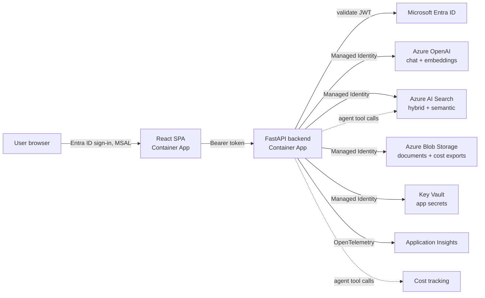

# Architecture

## Request flow

## Why each service is there

| Service | Role in this platform |
|---|---|
| **Azure OpenAI** | Chat completions (`gpt-4o`) and embeddings (`text-embedding-3-large`), called via Managed Identity, never an API key, in production. |
| **Azure AI Search** | Hybrid (BM25 + vector) + semantic-ranked retrieval over the ingested document chunks — the "R" in RAG. |
| **Azure Blob Storage** | Source-of-truth for ingested documents, and the durable sink for cost-tracking JSONL exports. |
| **Azure Container Apps** | Hosts both the FastAPI backend and the React frontend as separate, independently scalable revisions, behind HTTPS ingress, scaling on concurrent request count. |
| **Managed Identity** | One user-assigned identity, shared by both Container Apps, granted least-privilege RBAC roles on every other resource (`infra/modules/*.bicep`). No connection strings or API keys in config for any Azure-AD-auth-capable service. |
| **Entra ID** | Authenticates end users (SPA, MSAL) and authorizes API calls (JWT bearer validation, app roles `ingest`/`admin`, optional group-based access) — see `backend/app/auth/entra.py`. |
| **Application Insights** | OpenTelemetry auto-instrumentation for every request, plus custom events for token usage, cost, and evaluation scores — one place to query latency, errors, spend and RAG quality together. |
| **Key Vault** | RBAC-authorized (no access policies) secret store for the handful of values that are genuinely secret (e.g. an alert webhook URL), referenced by Container Apps at deploy time. |
| **CI/CD** | `ci.yml` lints/tests/builds on every PR; `cd.yml` builds, pushes to ACR and deploys on merge to `main`, using OIDC (no stored Azure credentials); `evaluation.yml` runs the RAG quality gate on a schedule and on retrieval/agent code changes. |
| **Docker** | Both services are containerized (`backend/Dockerfile`, `frontend/Dockerfile`), runnable identically via `docker-compose.yml` locally and as Container Apps in Azure. |
| **Evaluation** | `backend/evaluation` scores every answer to a golden Q&A set on groundedness, relevance, coherence (Azure AI Evaluation SDK) and retrieval precision (custom), gating CI on a quality threshold. |
| **Cost tracking** | Every Azure OpenAI call is metered (`backend/app/core/cost_tracking.py`): $ computed from token counts, emitted to App Insights, persisted to Blob Storage, and exposed via `/api/cost/summary` plus a live badge in the UI, with a budget-exceeded webhook alert. |

## Demo mode

`DEMO_MODE=true` (the default in `.env.example`) reroutes both chat endpoints away from Azure entirely:

- `POST /api/chat/completions` → [`app/rag/demo.py`](../backend/app/rag/demo.py) — pure-Python TF-IDF cosine
  similarity over the bundled `app/data/sample_docs`, no embeddings, no network calls.
- `POST /api/chat/agent` → [`app/agents/demo_orchestrator.py`](../backend/app/agents/demo_orchestrator.py) —
  keyword rules stand in for the model's tool-choice decision (cost questions → `CostLookup`, everything else
  → `KnowledgeBase`), so the agentic UX is still visible without a live model.

Both return the same response shape (`RagAnswer` / citations / retrieval score) as the real implementations,
so the API contract and frontend don't change based on mode — only which module answers the call. This exists
purely so the project is runnable end-to-end with zero Azure account and zero spend; set `DEMO_MODE=false`
with real credentials to exercise the actual pipeline described below.

## Two ways to ask a question

- **`POST /api/chat/completions`** — plain RAG. Always embeds the question, retrieves top-k chunks from AI Search, and generates a grounded answer with citations (`backend/app/rag/pipeline.py`). Predictable latency and cost.
- **`POST /api/chat/agent`** — agentic. A Semantic Kernel agent (`backend/app/agents/orchestrator.py`) decides, per turn, whether to call the `KnowledgeBase` search tool, the `CostLookup` tool, both, or neither — this is the "agentic" half of Agentic RAG.

## Data flow: ingestion

`POST /api/documents/upload` (or `scripts/seed_sample_data.py`) → Blob Storage → chunked (`backend/app/ingestion/chunking.py`, paragraph-aware, ~400 tokens/chunk with overlap) → embedded in batches → upserted into the AI Search index (`backend/app/services/ai_search.py`, created on first use with a vector field + HNSW + semantic config).

## Security posture

- `disableLocalAuth: true` on both Azure OpenAI and AI Search — key-based auth is off at the resource level, not just unused by the app.
- Key Vault uses RBAC authorization, not the legacy access-policy model.
- Storage account blocks public blob access; all data access is Managed-Identity RBAC.
- The API validates Entra ID JWTs (issuer, audience, signature via JWKS) on every request unless `DISABLE_AUTH=true` (local dev only), and enforces app-role checks (`ingest`, `admin`) on the ingestion and evaluation-report endpoints.
